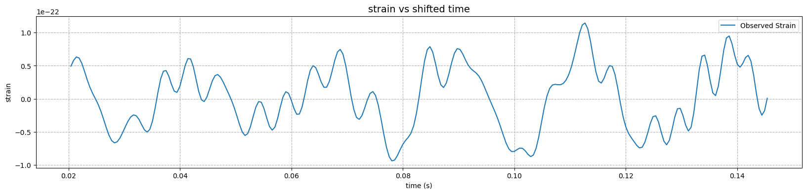
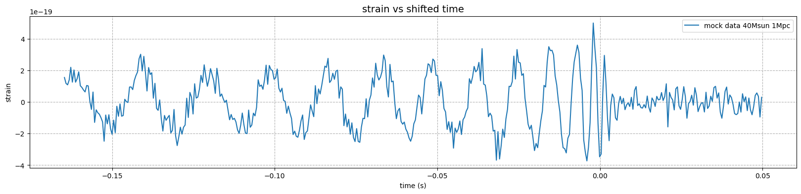
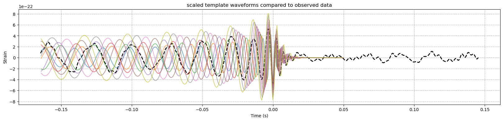

# What caused this gravitational wave signal?


## Part A - Background 


Import all packages that we will use throughout


```python
import numpy as np 
import pylab as plt
import pandas as pd
```

#### Part 1: 
It is important for this project to understand the different parts of the waveform produced due to gravitational waves from a
merging black hole event.

A gravitational wave signal from a merging black hole event can be split into three distinct parts: 
<br>
**(1) Inspiral phase:** During the inspiral phase the binary BH orbit is constantly losing energy due to the emission of gravitational waves. As a result they orbit closer together. The amplitude of the waveform gradually increases and the period decreases as the BHs get closer together. 
<br>
**(2) Merger phase:** When the two black holes are close enough they rapidly merge into a single black hole. The amplitude of the waveform peaks during the merger, the frequency also peaks due to the rapid orbital motion during this phase. 
<br>
**(3) Ringdown phase:** The single newly formed BH continues to emit gravitational waves as it settles into a stable Kerr state. The amplitude of the waveform drops sharply and the frequency becomes stable based on the properties of the new BH. 

#### Part 2: 
We can plot the total mass of the merging sources against their distance.

##### Solution: 
**Step 1:** Use the pandas package to read the gravitationalwaveevents.csv file, validate this worked by printing the data. 
<br>
**Step 2:** Extract into seperate arrays the Mtot and DL columns, as these are total mass and distance of the merging sources. Also have seperate arrays for the Mtot_err and DL_err columns, these correspond to the errors or credible intervals from the parameters distribution. 
<br>
**Step 3:** Plot the total mass (Mtot) against distance (DL) and include error bars where x error equals DL_err and the y error is Mtot_err.


```python
#PART A:
#2: 

#using pandas to read file
GWevents = pd.read_csv('gravitationalwaveevents.csv')
#print to validate
print(GWevents)

#create seperate arrays/objects for each column for plotting
DL = GWevents['DL']
DL_err = GWevents['DL_err']
Mtot = GWevents['Mtot']
Mtot_err = GWevents['Mtot_err']

#print just one to validate that it worked 
print(DL)
```

            DL  DL_err  Mtot  Mtot_err  Mchirp  Mchirp_err detType
    0    430.0   170.0  63.1       3.0  28.600      -1.500      GW
    1   1060.0   480.0  35.7       3.8  15.200      -1.100      GW
    2    440.0   190.0  20.5       1.5   8.900      -0.300      GW
    3    960.0   410.0  49.1       3.9  21.500      -1.700      GW
    4    320.0   110.0  17.8       0.7   7.900      -0.200      GW
    5   2750.0  1320.0  80.3      10.2  35.700      -4.700      GW
    6    990.0   380.0  56.4       3.7  25.000      -1.600      GW
    7    580.0   210.0  53.4       2.4  24.200      -1.100      GW
    8     40.0    10.0   2.8       NaN   1.186      -0.001      GW
    9   1020.0   360.0  59.8       3.8  26.700      -1.700      GW
    10  1850.0   840.0  65.6       6.6  29.300      -3.200      GW
    0      430.0
    1     1060.0
    2      440.0
    3      960.0
    4      320.0
    5     2750.0
    6      990.0
    7      580.0
    8       40.0
    9     1020.0
    10    1850.0
    Name: DL, dtype: float64
    


```python
#plot total mass against distance with error bars 
plt.figure(figsize=(8, 5))
plt.errorbar(DL, Mtot, xerr=DL_err, yerr=Mtot_err, fmt='o',color = 'r' , ecolor='k' ,  capsize=3, label="events") #appropriate colours and capsize
plt.xlabel("Distance (Mpc)")
plt.ylabel("Total Mass (Mtot, $M_\odot$)")
plt.title("Total Mass vs Distance" ,fontsize = 14)
plt.grid(linestyle='--')
plt.legend()
```


    <matplotlib.legend.Legend at 0x200473e3410>


    

    


## Part B - The data 


#### Part 1: 
Our observed waveform is located in the file Observedwaveform.csv, we first need to read access this data.


```python
#PART B: 
#1:
waveform_data = pd.read_csv('Observedwaveform.csv')
print(waveform_data)
```

               strain      time (s)
    0    8.101405e-23  1.205952e+09
    1    1.019082e-22  1.205952e+09
    2    1.226521e-22  1.205952e+09
    3    1.396412e-22  1.205952e+09
    4    1.522380e-22  1.205952e+09
    ..            ...           ...
    631  8.309607e-24  1.205952e+09
    632 -1.486847e-23  1.205952e+09
    633 -2.480454e-23  1.205952e+09
    634 -1.817704e-23  1.205952e+09
    635  8.280734e-25  1.205952e+09
    
    [636 rows x 2 columns]
    

#### Part 2:
The GPS time of the merger for the waveform is 1205951542.153363. To compare our waveform data to model waveforms we must have the merger event occur at t = 0.
<br>
To do this we can simply create a variable merger_time = 1205951542.153363, which is the time given for the merger. Then subtract this time from each element in the "time (s)" column, put the result into a new column "time_shifted (s)". This new shifted column will have the merger occuring at t=0, we can use this column for comparisons and plotting. 


```python
#2: 
merger_time = 1205951542.153363

#shift the time column so the merger occurs at t = 0 seconds
waveform_data['time_shifted (s)'] = waveform_data['time (s)'] - merger_time
print(waveform_data)
```

               strain      time (s)  time_shifted (s)
    0    8.101405e-23  1.205952e+09         -0.164658
    1    1.019082e-22  1.205952e+09         -0.164169
    2    1.226521e-22  1.205952e+09         -0.163681
    3    1.396412e-22  1.205952e+09         -0.163193
    4    1.522380e-22  1.205952e+09         -0.162705
    ..            ...           ...               ...
    631  8.309607e-24  1.205952e+09          0.143448
    632 -1.486847e-23  1.205952e+09          0.143936
    633 -2.480454e-23  1.205952e+09          0.144424
    634 -1.817704e-23  1.205952e+09          0.144913
    635  8.280734e-25  1.205952e+09          0.145401
    
    [636 rows x 3 columns]
    

Print to see our new time_shifted (s) column has been created. We can also plot the data to verify visually that this worked.


```python
waveform_time = waveform_data['time_shifted (s)'].values
waveform_strain = waveform_data['strain'].values


#strain vs shifted time (s)
plt.figure(figsize=(20, 4))
plt.plot(waveform_time, waveform_strain, label='Observed Strain')
plt.title('strain vs shifted time', fontsize=14)
plt.xlabel('time (s)')
plt.ylabel('strain')
plt.legend()
plt.grid(linestyle = "--")
```


    

    


From this plot we can verify that the merger occurs at time = 0, which is what we require going forward.

#### Part 3:
We need to estimate the average noise and its standard deviation in our observed data. To estimate the noise we should use the region with the smallest amount of gravitational wave signal. In our data this is the ringdown phase region, after the newly formed black hole has become stable. On our strain vs shifted time plot from part 2, we can estimate this as the region from ~0.025 seconds to the end of the data. 
<br>
Therefore to estimate the average noise and its standard deviation we should:
<br>
**Step 1:** Define the region were the noise can be seen in the waveform.
<br>
**Step 2:** Filter the data to only include this stable ringdown region. Calculate the mean and standard deviation of strain in this time region. This will be the mean and standard deviation of our noise. We could also plot just the filtered data to confirm we have selected a suitable region.


```python
#filter the data for the region after the merger (t > 0.02)
noise_data = waveform_data[waveform_data['time_shifted (s)'] > 0.02]
```

After some testing, the region selected was the strain when t > 0.02s. This region is appropriate as it is far enough after the merger phase, so we can ensure the unstable ringdown signal from directly after the merger is not present. It is also a large portion of the data set to estimate an accurate mean and standard deviation. We can create a plot to ensure this is an appropriate region.


```python
#strain vs shifted time (s)
plt.figure(figsize=(20, 4))
plt.plot(noise_data['time_shifted (s)'], noise_data['strain'], label='Observed Strain')
plt.title('strain vs shifted time', fontsize=14)
plt.xlabel('time (s)')
plt.ylabel('strain')
plt.legend()
plt.grid(linestyle = "--")
```


    

    


From this plot we can see the stable ringdown signal from the single kerr black hole formed after merger. This signal has much lower amplitude than the inspiral and merger signals. The plot does not contain any of the ringdown directly after the merger, which also has a much higher amplitude. Therefore we can confirm this as a suitable region for noise estimation.


```python
#calculate the mean and standard deviation of the strain in this new noise window
noise_mean = noise_data['strain'].mean()
noise_std = noise_data['strain'].std()

#display appropriately 
print(f"Noise Mean: {noise_mean:.3e}")
print(f"Noise Standard Deviation: {noise_std:.3e}")
```

    Noise Mean: 1.496e-24
    Noise Standard Deviation: 4.797e-23
    

***

## Part C - Interpolate reference model to match the observed data time sampling 


#### Part 1:
For this part we need to access the mock data file. Our data waveform starts at some time
𝑡min. We must first find out what this is. Next, we can take the observed data waveform and output data for t > tmin and t< 0. We then plot to verify that the new observed waveform only has data in this restricted time range. 


```python
#PART C: 
#1: 
mockdata_waveform_40Msun_1Mpc = pd.read_csv('mockdata_waveform_40Msun_1Mpc.csv')

#strain vs shifted time (s) 
#plot to visualise the mock data
plt.figure(figsize=(20, 4))
plt.plot(mockdata_waveform_40Msun_1Mpc['time (s)'], mockdata_waveform_40Msun_1Mpc['strain'], label='mock data 40Msun 1Mpc')
plt.title('strain vs shifted time', fontsize=14)
plt.xlabel('time (s)')
plt.ylabel('strain')
plt.legend()
plt.grid(linestyle = "--")
```


    

    


```python
t_min = mockdata_waveform_40Msun_1Mpc['time (s)'].min() 
print(f"t_min: {t_min} ")

t_min_o = waveform_data['time_shifted (s)'].min()
print(f"t_min_o: {t_min_o} ")

```

    t_min: -0.1646575927734375 
    t_min_o: -0.1646575927734375 
    

Our t_min value is expected as it matches our plot.


```python
mockdata_strain = mockdata_waveform_40Msun_1Mpc['strain'].values
mockdata_time = mockdata_waveform_40Msun_1Mpc['time (s)'].values

index = np.where((waveform_time > t_min)&(waveform_time < 0.05))[0]

```


```python
#strain vs shifted time (s) 
plt.figure(figsize=(20, 4))
plt.plot(waveform_time[index], waveform_strain[index], label='observed data between t_min and 0')
plt.title('strain vs shifted time', fontsize=14)
plt.xlabel('time (s)')
plt.ylabel('strain')
plt.legend()
plt.grid(linestyle = "--")
```


    

    


observed waveform data is now only contained in the restricted range. 

#### Part 2:
Now we are going to convert our reference waveform from the *reference_waveform_40Msun_1Mpc.csv* file, which has 22,000+ data points, to have the same number of x data points as our mock data, which has 337 data points. We will do this using the interpolation object in python.
<br>
**Step 1:** Open the reference file reference_waveform_40Msun_1Mpc.csv using pandas. Plot to verify.
<br>
**Step 2:** Create an interpolation object using the reference waveform, and use this to interpolate the data waveform. 
<br>
**Step 3:** Plot the interpolated strain against the mock data time. 


```python
#Part C:
#2:
reference_waveform_40Msun_1Mpc = pd.read_csv('reference_waveform_40Msun_1Mpc.csv')
ref_time = reference_waveform_40Msun_1Mpc['time (s)'].values
ref_strain = reference_waveform_40Msun_1Mpc['strain'].values

#strain vs shifted time (s) 
#plot to visualise the reference data
plt.figure(figsize=(20, 4))
plt.plot(ref_time, ref_strain, label='reference data for 40Msun and 1Mpc')
plt.title('strain vs shifted time', fontsize=14)
plt.xlabel('time (s)')
plt.ylabel('strain')
plt.legend()
plt.grid(linestyle = "--")
```


    

    


```python
from scipy.interpolate import interp1d


#interpolation object using a reference waveform 
interp_fn = interp1d(ref_time,ref_strain,bounds_error=False)
#interpolate the data waveform
interp_strain = interp_fn(mockdata_time)


#strain vs shifted time (s) 
#plot to visualise the reference data
plt.figure(figsize=(20, 4))
plt.plot(mockdata_time, interp_strain, label='interpolated reference strain')
plt.plot(mockdata_time, mockdata_strain, label='mock data')
plt.title('strain vs shifted time', fontsize=14)
plt.xlabel('time (s)')
plt.ylabel('strain')
plt.legend()
plt.grid(linestyle = "--")
```


    

    


***

## Part D - Create model waveforms to estimate the total mass and distance to the system.


#### Part 1: 
Write a function in python to produce the time 𝑡 and strain ℎ of a general waveform with 𝑞 = 1, total mass 𝑀 and distance D.

##### Solution:
Our function will return the time t and strain h that will create a general waveform for any desired total mass M and distance D parameters. To do this we scale our reference waveform by changing its distance and mass. 
<br>
If we have an equal-mass system with $q=1$, total mass $M=M_1 + M_2$ at a distance $D$, then we can scale the strain of a waveform, $h(t,M,D)$ from a reference waveform with $h(t_{\rm {ref}},M_{\rm {ref}},D_{\rm {ref}})$. The scaled time $t$ can be given as:

$$ t=\left(\dfrac{M}{M_{\rm {ref}}}\right)t_{\rm {ref}}  $$

where $t=0$ is defined as being the time at which the merger occurred. 
<br>
The scaled strain $h(t,M,D)$ can be given as:

$$
h(t,M,D) = \left(\dfrac{M}{M_{\rm {ref}}}\right) \left(\dfrac{D_{\rm {ref}}}{D}\right) h(t_{\rm {ref}}) 
$$
<br>
These equations will be used in our function to scale the waveform. We also require the use of our previously defined interpolation object so that our returned waveform has the correct number of x data points. The function we create should be able to produce model waveforms or templates that can be compared against observed data to determine best fit parameters, for these comparisons we require the same number of x data points. 


```python
#PART D:
#1:

def generate_waveform(interp_fn, t_ref, M_ref, D_ref, M, D):
   
    #scaled time: t = (M / M_ref) * t_ref
    scaled_time = (M / M_ref) * t_ref
    
    #interpolate the strain at reference time points
    h_ref = interp_fn(t_ref)
    
    #scaled strain: h(t, M, D) = (M / M_ref) * (D_ref / D) * h(t_ref)
    scaled_strain = (M / M_ref) * (D_ref / D) * h_ref

    #create new interpolation function with the scaled time and strain
    interp_fn1 = interp1d(scaled_time,scaled_strain,bounds_error=False)

    #interpolate at the reference time points to match the 
    h = interp_fn1(t_ref)
    
    return scaled_time, h

```

This function takes inputs interp_fn, t_ref, M_ref, D_ref, M and D. 
<br>
**interp_fn:** the interpolation function created for the reference waveform 
<br>
**t_ref:** the time array of the data we are trying to scale the waveform to
<br>
**M_ref and D_ref:** Total mass and distance of the reference waveform
<br>
**M and D:** The desired total mass and distance for the generated waveform 
<br>
<br>
The function first calculates the scaled time using the above equations. 
<br>
Then we use the interpolation function to evaluate the strain of the reference waveform at the reference time. ($h(t_{\rm {ref}})$ in the above equations)
<br>
The we can use this to calculate the scaled strain ($h(t,M,D)$) and finally return the scaled time and strain.

#### Part 2:
To ensure our function is producing accurate results we must test it and compare against mock data with known parameters.
<br>
Call the function with values of $M = 70M_{\rm {sun}}$ and $D = 5Mpc$ and plot the returned waveform. Compare this to the mock data for the same mass and distance in the *mockdata_waveform_70Msun_5Mpc.csv* file. 

```python
mockdata_waveform_70Msun_5Mpc = pd.read_csv('mockdata_waveform_70Msun_5Mpc.csv')
mock_time = mockdata_waveform_70Msun_5Mpc['time (s)'].values
mock_strain = mockdata_waveform_70Msun_5Mpc['strain'].values
```


```python
#PART D:
#2:

#parameters
M_ref = 40  #reference mass (Msun)
D_ref = 1   #reference distance (Mpc)
M = 70      #desired mass (Msun)
D = 5       #desired distance (Mpc)


#generate scaled waveform
t, h = generate_waveform(interp_fn, mock_time, M_ref, D_ref, M, D)

#plot both waveforms for comparison
plt.figure(figsize=(20, 4))
plt.plot(mock_time, mock_strain, label="mock Data (70Msun, 5Mpc)")
plt.plot(mock_time, h, label="Generated Scaled Waveform")
plt.xlabel("Time (s)")
plt.ylabel("Strain")
plt.title("Comparison of scaled waveform to mock waveform")
plt.xlim(-0.17,0.06)
plt.legend()
plt.grid()
plt.show()
```


    

    


Testing our function against the mock data produces encouraging results. The generated waveform perfectly matches the mock data for the same mass and distance. This proves that our function is working as intended and we can use it to produce template waveforms to fit parameters.

#### Part 3:
An initial "by eye" estimate can be made for the best fit of our mass and distance paramters. To do this we can generate multiple template waveforms with different masses and distances, then compare these waveforms with our observed data to find an approximate fit. This is a very rough approximation which will be reflected in the large uncertainties.
<br>
**Step 1:** Create arrays of test masses and distances that will be used to generate the model waveforms. Choose an appropriate increment (5Msun and 100Mpc).
<br>
**Step 2:** Generate and plot all the template waveforms, also plot the observed data.
<br>
**Step 3:** Do a simple "by eye" estimate to select the waveforms that most closely match the observed data, display these results appropriately and comment on the accuracy of this method.


```python
#PART D:
#3: 

waveform_time = waveform_data['time_shifted (s)'].values
waveform_strain = waveform_data['strain'].values

t_min = waveform_data['time_shifted (s)'].min() 
t_max = waveform_data['time_shifted (s)'].max() 
index = np.where((waveform_time > t_min)&(waveform_time < 0.05))[0]

#define a function to compare waveforms visually
def compare_waveforms(waveform_time, waveform_strain, interp_fn, M_ref, D_ref, M_range, D_range):
    
    plt.figure(figsize=(20, 4))
    
    #plot observed data
    plt.plot(waveform_time, waveform_strain, label="waveform data", linestyle="dashed", linewidth=2, color="black")
    
    #loop over masses and distances
    for M in M_range:
        for D in D_range:
            t, h = generate_waveform(interp_fn, waveform_time[index], M_ref, D_ref, M, D)
            plt.plot(waveform_time[index], h, label=(f"M={M} Msun, D={D:.1f} Mpc"), alpha=0.6)
    
    #format
    plt.xlabel("Time (s)")
    plt.ylabel("Strain")
    plt.title("scaled template waveforms compared to observed data")
    #plt.legend()
    #plt.xlim(-0.17,0.15)
    plt.grid(linestyle = "--")
    
```

##### Plot 1 (constant mass)


```python
#define mass and distance ranges for testing
M_range = np.arange(60, 61, 5)  #masses
D_range = np.arange(1000, 2001, 100)  #distances

#compare waveforms
compare_waveforms(waveform_time, waveform_strain, interp_fn, M_ref, D_ref, M_range, D_range)
```


    

    


##### Plot 2 (constant distance)


```python
#define mass and distance ranges for testing
M_range = np.arange(40, 81, 5)  #masses
D_range = np.arange(1000, 1001, 100)  #distances

#compare waveforms
compare_waveforms(waveform_time, waveform_strain, interp_fn, M_ref, D_ref, M_range, D_range)
```


    

    


From plot 1 and 2, I can now change both parameters and close in on my estimated best fit values.

##### Plot 3 (changing both mass and distance in a smaller range)


```python
#Plot 3 (chaning both mass and distance in a smaller range)
M_range = np.arange(70, 80, 2)  #masses
D_range = np.arange(1400, 1601, 100)  #distances
compare_waveforms(waveform_time, waveform_strain, interp_fn, M_ref, D_ref, M_range, D_range)
```


    

    


After testing with several template waveforms, I arrived at a best fit estimate for mass of $M = (77 \pm 5)M_{\rm {sun}} $ and distance of $D = (1500 \pm 100)Mpc$. To asses the validity of these esimates I plotted them.

##### Plot 4 (final by eye estimates)


```python
M = 77
D = 1500

#generate scaled waveform
t, h = generate_waveform(interp_fn, mock_time, M_ref, D_ref, M, D)


#plot both waveforms for comparison
plt.figure(figsize=(20, 4))
plt.plot(waveform_time, waveform_strain, label="waveform data", linestyle="dashed", linewidth=2, color="black")
plt.plot(mock_time, h, label=(f"M={M} Msun, D={D:.1f} Mpc"))
plt.xlabel("Time (s)")
plt.ylabel("Strain")
plt.title("Comparison of scaled waveform to observed waveform")
plt.xlim(-0.17,0.06)
plt.legend()
plt.grid(linestyle = "--")

```


    

    


Plot 4 shows a close match between the by eye estimated parameters and the observed waveform.

I created plots 1 and 2 to explore how changing the mass and distance parameters effect the scaled waveform. 
<br>
Plot 1 is changing distance with a constant mass. This plot shows a larger distance reduces the amplitude of the strain, which is expected from the equation for scaled strain displayed in part 1. 
<br>
In plot 2 the mass is changed with a constant distance. Our equations show both the scaled time and strain depend on mass. Due to this a M-D degeneracy arises where different combinations of M and D can result in simular strain amplitudes and hence simular waveforms. This can make it challenging to estimate these parameters using the "by eye" method leading to the large uncertainties, hence the need for a more robust method.

***

## Part E - Estimating the total mass using MCMC 


#### Part 1: 
Use MCMC to sample the total mass and distance to find the “best values”.

The Markov-Chain Monte Carlo (MCMC) method has many uses, one of which is to fit models to data. This works by comparing generated template models against the observed data. In our case models will be generated by the mass and distance parameters using our function created in part D, we can sample from this set of parameters to produce best fit models for our data. 

We can use Bayes theorem to calculate the probability of our proposed model given our data, this is called the posterior probability:

$$ P(\theta|D)=\dfrac{P(D|\theta)P(\theta)}{P(D)} $$

$P(D|\theta)$: the likelihood
<br>
$P(\theta)$: the prior 
<br>
$P(D)$: probability of the data known as the evidence
<br>
where $\theta$ is the parameters of out model. The evidence is a constant for normalisation and does not effect the shape of the distribution, so we can ignore it in our calculation.


To implement the MCMC method we must:
<br>
**Step 1:** Create a log-likelihood function, this function should intake a mass and distance, create a model using our generate_waveform function and return the log of the likelihood $P(D|\theta)$ for the model. As we are comparing a model with data, that we can assume has gaussian noise distribtuion, we can base our function on a simple chi squared log-likelihood:
$$ \chi^2 = -\frac{1}{2} \sum{\frac{(y_{i} - y_{model})^2}{\sigma^2}} $$
**Step 2:** We can then define our priors. These encode information we already known about the system. In our case the total mass of the system is in the range $[20,100] M_{sun}$
<br>
**Step 3:** Make a intial guess for our parameters and calculate the posterior probability using our functions. (likelihood * prior) This will be our current likelihood.
<br>
**Step 4:** Draw from a uniform random distribution a value of $\delta \theta$. We can then propse a new value: $\theta_{proposed} = \theta_{current} + \delta \theta$
<br>
**Step 5:** Evaluate the posterior probability of these proposed value. 
<br>
**Step 6:** Compare the proposed likelihood with the current likelihood. We can do this by computing the acceptance probability. As we are using log likelihood this can be given by:
$$\alpha = \log({likelihood_{proposed}})-\log({likelihood_{current}})$$
<br>
**Step 7:** We can then decide to accept or reject the proposed value. We generate a random number $u_{random}$ between 0 and 1 then compare the log of this random number to our value of $\alpha$. if $u_{random} < \alpha$ we accept, if not we can reject. This is following the Metropolis-Hastings acceptance rule.
<br>
**Step 8:** Repeat step 4 to 7 for N number of steps. Then plot the resulting chain and posterior distribution.
<br>
An index can be used to define the region of the gravitational waveform to fit in, we can ignore the end of the waveform after the ringdown. This avoids erros with interpolating outside of the given region.


```python
def log_likelihood(waveform_strain, waveform_time, interp_fn, M_ref, D_ref, M, D, sigma):
    t,model_strain = generate_waveform(interp_fn, waveform_time_index, M_ref, D_ref, M, D)
    residual = waveform_strain - model_strain
    n = len(model_strain)
    
    return -0.5 * np.sum(residual**2/sigma**2) 
    
#MCMC
def mcmc(waveform_strain, waveform_time, interp_fn, M_ref, D_ref, M_initial, D_initial, sigma, n_steps, mass_step, distance_step):
    M_current = M_initial
    D_current = D_initial
    log_likelihood_current = log_likelihood(waveform_strain, waveform_time, interp_fn, M_ref, D_ref, M_current, D_current, sigma)
    #print(log_likelihood_current)
    M_chain = [M_current]
    D_chain = [D_current]
    
    acceptances = 0  #counter for when aceepted

    for i in range(n_steps):
        
        #propose new parameter values (theta)
        M_proposed = M_current + np.random.normal(0, mass_step)
        D_proposed = D_current + np.random.normal(0, distance_step)
        #print(M_current)
    
        #calculate log-likelihood for proposed parameters
        log_likelihood_proposed = log_likelihood(waveform_strain, waveform_time, interp_fn, M_ref, D_ref, M_proposed, D_proposed, sigma)

        #compute acceptance probability for log space
        log_acceptance_ratio = log_likelihood_proposed - log_likelihood_current
        
        #print(f"Step: {i}, Proposed: {M_proposed}, Current: {M_current}, "f"Log Acceptance Ratio: {log_acceptance_ratio:.2f}")
        
        random = np.log(np.random.rand())
        #print(random)
        
        #accept or reject the proposed parameters
        if random < log_acceptance_ratio:
            M_current = M_proposed
            D_current = D_proposed
            log_likelihood_current = log_likelihood_proposed
            acceptances += 1

        #create the chain for each parameter
        M_chain.append(M_current)
        D_chain.append(D_current)


    acceptance_rate = acceptances / n_steps
    print(f"Acceptance rate: {acceptance_rate:.2f}")
    return np.array(M_chain), np.array(D_chain)

#run the MCMC algorithm
M_initial = 75
D_initial = 1500
n_steps = 1000000
mass_step = 0.01
distance_step = 0.1
sigma = noise_mean #set to the noise value we calculated earlier

#only require the data between index, this also avoids any erros with interpolation
index = np.where((waveform_time > t_min)&(waveform_time < 0.05))[0]

waveform_strain_index = waveform_strain[index]
waveform_time_index = waveform_time[index]

M_chain, D_chain = mcmc(waveform_strain_index, waveform_time_index, interp_fn, M_ref, D_ref, M_initial, D_initial, sigma, n_steps, mass_step, distance_step)

```

    Acceptance rate: 0.22
    

After trying several different initial conditions and step sizes a mass step size of $0.01M_{sun}$ and distance step size of $0.1Mpc$ was selected. This was run intially for $10000$ steps. This set up gave an acceptance rate of $0.26$, this is within the expected range for the Metropolis-Hastings acceptance criteria, however the output could benefit from a larger number of steps to fully explore the parameter space. 
<br>
$1000000 (10^6)$ steps where used and this allowed for the posterior distribution to take an expected gaussian form. This also gave an acceptance ratio of $0.22$ which lies within the expected range. The main downside to this number of steps is the computation time and storage required. 

#### Part 2:
To appropriately analyse our findings from the MCMC we can plot the mass and distance chains, this allows us to visualise how the MCMC expolored the parameter space and determine if it converges onto a particular value. We can also plot the posterior distribution histogram for each parameter, we expect the histogram to take a gaussian distribution where the peak highlights the most likely value for the parameter. 


```python
#plot the results appropriately

#mass chain
plt.figure(figsize=(12, 6))
plt.subplot(2, 2, 1)
plt.plot(M_chain, label="Mass Chain")
plt.xlabel("step number")
plt.ylabel("Mass")
plt.ylim(76.98,77.02)
plt.legend()

#distance chain
plt.subplot(2, 2, 2)
plt.plot(D_chain, label="Distance Chain")
plt.xlabel("step number")
plt.ylabel("Distance")
plt.ylim(1660,1670)
plt.legend()

#include burn in
#mass histogram 
plt.subplot(2, 2, 3)
plt.hist(M_chain[10000:], bins=100, label="Posterior Distribution")
plt.xlabel("Mass")
plt.ylabel("Density")
plt.legend()

#distance histogram
plt.subplot(2, 2, 4)
plt.hist(D_chain[10000:], bins=100, label="Posterior Distribution")
plt.xlabel("Distance")
plt.ylabel("Density")
plt.legend()

plt.tight_layout()
plt.show()
```


    

    


Both parameters in our MCMC seem to converge on reasonable values. The total mass found from the MCMC was $M = (77.0026\pm{0.0030})M_{sun}$ and the distance found was $D = (1666.52^{+1.07}_{-1.15})Mpc$. The values are close to our by eye estimations which is a positive result and proves our implementation of the MCMC method is working. Our histograms also take the expected gaussian form around the highest probability parameter value.  
However looking closer at these plots it could be argued that the method implementation is not completely ideal. This is because once the chain reaches its convergence value it fails to adequately explore the parameter space, this is especially true for the mass chain looking at the Mass values explored on the y axis.
<br>
<br>
One reason that could explain this is the implementation used is very sensitive to the step-size. A small step size was selected as this met the desired acceptance ratio, however a step size too small may see the chain failing to explore too far from the high probability values which could be what we are seeing with the mass chain. A solution could be too create an adaptive step size which aims to meet a set acceptance rate. 
<br>
<br>
The initial guess value is also important, a bad intial guess can increase the amount of iteration required to find the convergence value. Furthermore, if the posterior distribution is multimodal, the chain could get stuck in a local minimum returning a value that isnt the true minimum. A burnin can be used to reduce the distributions dependance on the intial value, we have a large number of N steps $(10^6)$ and used our prior "by eye" estimates as starting parameters so a burnin likely isnt necessary, but we can still include it in part 3 when we are computing our values. 
<br>
To confirm our convergence it is important to trail multiple different intial guesses further from the prior value. We can compare the difference in the rolling means of each sample and this should tend to 0 as each sample converges. A well-tuned MCMC method should eventually converge regardless of the intial guess parameters.


```python

#rolling mean function
def rolling_mean(data, window):
    return np.convolve(data, np.ones(window)/window, mode='valid')

#generate multiple MCMC chains with different initial guesses
def run_multiple_chains(initial_guesses, n_steps, mass_step):
    M_chains = []
    for i in initial_guesses:
        M_chain_test,_ = mcmc(waveform_strain_index, waveform_time_index, interp_fn, M_ref, D_ref, M_initial, D_initial, sigma, n_steps, mass_step, distance_step)
        M_chains.append(M_chain_test)
    return M_chains

def convergence_test(M_chains, window):
    n_chains = len(M_chains)
    rolling_means = [rolling_mean(M_chain, window) for M_chain in M_chains]
    
    #compute differences between rolling means of each pair of chains
    differences = []
    for i in range(n_chains - 1):
        for j in range(i + 1, n_chains):
            diff = np.abs(rolling_means[i] - rolling_means[j][:len(rolling_means[i])])
            differences.append(diff)
    
    #average the differences for all pairs
    mean_difference = np.mean(differences, axis=0)
    return mean_difference

#initial guesses for mass parameter
initial_guesses = [50, 60, 77, 90, 100]  
n_steps = 10000
mass_step = 0.01
distance_Step = 0.1
window_size = 1000

#run the chains for each mass value
M_chains = run_multiple_chains(initial_guesses, n_steps, mass_step)

#calculate difference in means
mean_difference = convergence_test(M_chains, window_size)

#plot results
plt.figure(figsize=(8, 5))
plt.plot(mean_difference, label="Mean Difference of Rolling Means")
plt.axhline(0, color="red", linestyle="--", label="Target: Convergence")
plt.xlabel("Step")
plt.ylabel("Difference" )
plt.legend()
plt.title("Convergence Test")
plt.show()

```

    Acceptance rate: 0.29
    Acceptance rate: 0.30
    Acceptance rate: 0.30
    Acceptance rate: 0.30
    Acceptance rate: 0.31
    


    

    


It is clear from this convergence test that our MCMC converges on the same value given any intial guess. This test was conducted on the mass parameter and the intial guesses used were $[50, 60, 77, 90, 100] M_{sun}$. The plot shows that difference in the rolling mean of each mass chain tends to 0 as each chain converges on the same mass parameter value.

It should be mentioned that thinning could be used on our MCMC sample to reduce any autocorrelation present in the walk, this is done by keeping every n-th sample and removing the rest. This is also useful for reducing computationally expensive MCMC chains and producing clearer visual data. I have chosen not to use thinning on my data chains, as the convergence is already clear from previous plots and thinning can reduce the sample size and thus the precision of our parameter values.

#### Part 3:
We can calculate the median and 90% credible limits on the value of 𝑀, then compare the waveform given by the mean parameter values of the MCMC chains with the observed waveform using the generate_waveform function. 


```python
#compute statistics
import statistics

#for mass value
M_median = statistics.median(M_chain)
lower_limit_M = np.percentile(M_chain, 5)
upper_limit_M = np.percentile(M_chain, 95)

#for distance value
D_median = statistics.median(D_chain)
lower_limit_D = np.percentile(D_chain, 5)
upper_limit_D = np.percentile(D_chain, 95)

#print results
print(f"Median of M: {M_median:.4f}")
print(f"90% Credible Interval for M: ({lower_limit_M:.4f}, {upper_limit_M:.4f})")

print(f"Median of D: {D_median:.4f}")
print(f"90% Credible Interval for D: ({lower_limit_D:.4f}, {upper_limit_D:.4f})")
print()

#calculate mean mass and mean distance making sure to account for burn in.
burn_in = 10000
best_mass = np.mean(M_chain[burn_in:])
print(f"Best Estimate for Total Distance: {best_mass:.2f} Msun")

best_distance = np.mean(D_chain[burn_in:])
print(f"Best Estimate for Total Mass: {best_distance:.2f} Mpc")

model_time, model_strain = generate_waveform(interp_fn, waveform_time_index, M_ref, D_ref, best_mass, best_distance)

#plot both waveforms for comparison
plt.figure(figsize=(20, 4))
plt.plot(waveform_time_index, waveform_strain_index, label="waveform data", linestyle="dashed", linewidth=2, color="black")
plt.plot(waveform_time_index, model_strain, label=(f"M={best_mass} Msun, D={best_distance} Mpc"))
plt.xlabel("Time (s)")
plt.ylabel("Strain")
plt.title("Comparison of scaled waveform to observed waveform")
plt.xlim(-0.17,0.06)
plt.legend()
plt.grid(linestyle = "--")
```

    Median of M: 77.0026
    90% Credible Interval for M: (76.9996, 77.0056)
    Median of D: 1666.5321
    90% Credible Interval for D: (1665.4494, 1667.6255)
    
    Best Estimate for Total Distance: 77.00 Msun
    Best Estimate for Total Mass: 1666.54 Mpc
    


    

    


The median and 90% credible limits on my values were: $M = (77.0026\pm{0.0030})M_{sun}$ and $D = (1666.52^{+1.07}_{-1.15})Mpc$. These values were found to an extremely high precision given by the 90% credible limits, however this precision seems too impressive from a simple two parameter fit to the waveform. This could reflect the problem in my MCMC sampling mentioned earlier as the parameter space was not adequately explored or perhaps an incorrect estimation of the noise in the signal. The distance parameter can be degenerate with the inclination of the system as they both depend on amplitude, therefore unless we have strong assumptions about the system our errors cannot be this small and these likely do not represent the actual precision of our estimates.  
<br>
A total mass of $M \approx 77M_{sun}$ at this distance is consistent with the mass of a binary black hole merger, however more evidence is required to confirm this.
<br>
The generated waveform seems an appropriate fit and matches the observed waveform well, especially throughout the early inspiral and the merger phase, the amplitude and phase alignment are in close agreement which serves to validate the parameters estimated from the MCMC. During the late inspiral from $t \sim -0.05$ to $t = 0$ there is slight deviations to the fit, this could arise due to higher order effects that were not considered in our modelling such as eccentricity or inclination as we have assumed a circular orbit. It could also represent a very small mass difference in the bodies, however a notable difference in mass is not identified and the assumption of $q = 1$ represents the system to reasonable accuracy. Overall the fit is excellent and demonstrates a succesful method using the MCMC. 

***

## Part F - Putting it all together 

#### Part 1:
Estimate the chirp mass for your system and the individual masses of the merging bodies.

The chirp mass of a binary system determines the orbital evolution of the system as a result of energy lost from emitted gravitational waves.
<br>
To estimate the chirp mass we can use the following formula:
$$M_{ch} = \frac{(M_1M_2)^{3/5}}{(M_1+M_2)^{1/5}}$$
where $M_1$ and $M_2$ are the masses of the two merging objects.
<br>
Given that $q = \frac{M_2}{M_1}$ we can express $M_1$ and $M_2$ in terms of total mass of the system $M$ and $q$ :
$$M_1=\frac{M}{1+q}, \space \space M_2=\frac{qM}{1+q}$$
we can then substitute these into the chirp mass formula to get the chirp mass in terms of total mass of the system $M$ and $q$:
$$M_{ch}=M\frac{q^{3/5}}{(1+q)^{6/5}}$$


```python
def chirp_mass(total_mass, q):
    return total_mass * (q**(3/5)) / ((1 + q)**(6/5))


def individual_masses(total_mass, q):
    M1 = total_mass / (1 + q)
    M2 = q * total_mass / (1 + q)
    return M1, M2

total_mass = best_mass  
q = 1  #equal mass binaries
chirp_mass = chirp_mass(total_mass, q)
print(f"Chirp mass: {chirp_mass:.2f} Msun")

M1, M2 = individual_masses(total_mass,q)
print(f"M1: {M1:.2f} Msun, M2: {M2:.2f} Msun")
```

    Chirp mass: 33.52 Msun
    M1: 38.50 Msun, M2: 38.50 Msun
    

In our gravitational wave scaling equations we have assumed that $q=1$ or the binary objects have the same mass. Our waveform fit can serve to justify this assumption as they match closely with the observed waveform. For comparable masses, $q \sim 1$, the waveform produced has a symetric amplitude, which is exactly what we see from the comparison in part E. 
<br>
The individual masses of $M_1 = M_2 \approx 38.50M_{sun}$, derived from the $q \sim 1 $ assumption, suggest the binary objects are black holes. This is in the higher range mass of black holes implying they formed from massive progenitor stars. These masses are consisten with high-mass black holes detected by LIGO and Virgo. 
<br>
A chirp mass of $M_{ch} = 33.52M_{sun}$ also indicates that our system is high mass and has a high frequency merger. 

#### Part 2: 
Now we can estimate the period from the observed waveform around the peak amplitude of the wave.

**Step 1:** Find where the amplitude of the waveform strain peaks.
<br>
**Step 2:** Define a small window around the peak amplitude to measure the period in, this window should only include the merger phase and not the inspiral or ringdown.
<br>
**Step 3:** Find the time at each zero-crossing. This is the point where the waveform changes sign. Then we can calculte the average time between the consecutive crossing times and hence the period of the gravitational waveform.
<br>
**Note:** After half a revolution, the two objects have just swapped positions, therefore on orbital period in the gravitational waves observed comprises two periods of the gravitational wave signal. That is $P_{GW} = \frac{P_{orb}}{2}$.


```python
def estimate_period(time, strain):
   
    #peak amplitude index
    peak_index = np.argmax(np.abs(strain))  # Find index of peak amplitude
    peak_time = time[peak_index]
    
    #define window around the peak
    window = 0.008  # Adjust window size as needed
    window_index = (time > (peak_time - window)) & (time < (peak_time + window))
    #time and strain for only the part of the waveform inside the window
    window_time = time[window_index]
    window_strain = strain[window_index]
    
    #find zero-crossings
    zero_crossings = np.where(np.diff(np.sign(window_strain)))[0]
    if len(zero_crossings) > 1:
        #calculate time differences between consecutive zero-crossings
        crossing_times = window_time[zero_crossings]
        periods = np.diff(crossing_times)
        average_period = np.mean(periods)
    
    return average_period

period = estimate_period(waveform_time_index, waveform_strain_index)
print(f"Estimated period: {period:.5f} seconds")

```

    Estimated period: 0.00354 seconds
    


```python
plt.figure(figsize=(20, 4))
plt.plot(waveform_time_index, waveform_strain_index, label="Observed waveform")
plt.axvline(x=waveform_time_index[np.argmax(np.abs(waveform_strain_index))], color='r', linestyle='--', label="peak amplitude")
plt.axvline(x=waveform_time_index[np.argmax(np.abs(waveform_strain_index))]+0.008, color='b', linestyle='--', label="window bounds")
plt.axvline(x=waveform_time_index[np.argmax(np.abs(waveform_strain_index))]-0.008, color='b', linestyle='--')
plt.legend()
plt.title("Observed Waveform with Peak Amplitude")
plt.xlabel("Time (s)")
plt.ylabel("Strain")
plt.xlim(-0.17,0.06)
plt.legend()
plt.grid(linestyle = "--")
```


    

    


Here the plot shows the window around the peak amplitude we are measuring the period in, this window contains 5 zero-crossings which gives a reasonable estimation for period at the merger. 
<br>
The period estimated is $P_{GW} = 0.00354s$, this corresponds to a near merger gravitational wave frequency of: $f_{GW} = 282Hz$. This frequency is consistent with our total mass and chirp mass of the system, which is further supporting evidence of two binary black hole objects in our system. 
<br>
We calculate the orbital period and frequency: $P_{orb} = 2 \times P_{GW} = 0.00708s$ and $f_{orb} = 141Hz$. These values are also consistent with the dynamics of large mass binary black holes at the time near merger. 

#### Part 3:
Use the period to estimate the orbital separation in km of the two bodies around peak amplitude.
<br>
Assuming the objects are not spinning and are in circular Keplerian orbits until the merger, then the orbital seperation of the two bodies at peak amplitude can be given by:
$$R = \left( \frac{G(M_1+M_2)}{\omega^2_{max}}\right) ^{1/3}$$
where $G$ is the gravitational constant and $\omega^2_{max}$ is the angular frequency which is related to the gravitational wave period calculated in part 2 via the formula: $\omega _{max}= \frac{2\pi }{2P_{GW}}$. This was found using the relationship between orbital and gravitational wave period already mentioned: $P_{orb} = 2 \times P_{GW}$.


```python
def seperation(M1,M2,omega):
    #constants
    G = 6.674e-11
    Msun = 1.989e30 #convert to kg for correct units
    return ((G*(M1+M2)*Msun)/omega**2)**(1/3)

omega = np.pi/period
R = seperation(M1,M2,omega)
R_km = R/1000
print(f"Oribital seperation, R = {R_km:.2f}km")
```

    Oribital seperation, R = 235.00km
    

The orbital seperation was given as: $R = 235km$. For comparison the orbit of Mercury has $R \approx 53 \times 10^6km$.

#### Part 4:
What does our analysis suggest are the best astrophysical candidates for the merging objects?


The merging objects are likely black holes formed from massive progenitor stars. With our justified assumption of $q \sim 1$ we derived individual masses of $M_1 = M_2 \approx 38.50M_{sun}$ and a chirp mass of $M_{ch} = 33.52M_{sun}$. Both of these are consistent with black holes and too large for to be the masses of neutron stars. The near merger gravitational wave frequency is also consistent with the rest of our analysis, being lower due to the high mass binary objects. The amplitude of our model MCMC waveform matches that of the observed waveform, which justifys our fit parameters and hence our conclusion that the merging objects are black holes. 
<br>
Although the analysis suggests black holes as the merging objects it is also worth considering the higher order effects on the waveform, such as eccentricity and spin of the objects as these will alter our estimations and could change the way we see the system. 

#### Sources: 
https://arxiv.org/pdf/1608.01940

***


